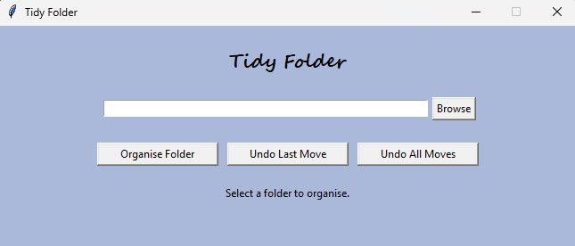

# tidy-folder

A Python script that automatically organises files in a folder into categories such as **Documents**, **Images**, **Videos**, **Code**, and **Others**.

---

## Features

- Sorts files into folders based on file type
- GUI and CLI versions available
- Prevents filename conflicts by renaming duplicates  
- Undo functionality to revert moves  
- Automatically creates folders when needed  
- You can add or remove file types by editing `file_categories.py`
  
## Installation

### Option 1: Using Git (recommended)
If you have Git installed, run the following in your terminal:

```bash
git clone https://github.com/d-tuzzy/tidy-folder.git
cd tidy-folder
```

### Option 2: Without Git 
1. Click **Code → Download ZIP** on GitHub.  
2. Extract the ZIP to a folder of your choice (for example, `C:\Users\Dan\Downloads\tidy-folder`).  
3. Open a terminal (PowerShell or CMD on Windows, Terminal on macOS/Linux).  
4. Navigate to the folder where you extracted the files.

## CLI Version
Once you are in the project folder, run:

```bash
python tidy_folder.py
```

### Example Usage

```
Enter the path to the folder you want to organise (q to quit):
> C:\Users\Daniel\Downloads\Test

Folder organised successfully!
Type 'u' to undo this move,
'a' to undo ALL moves this session,
or press ENTER to continue: 
```

Type `u` when prompted if you want to undo the move.
Type `a` if you want to undo all moves in the session.

## GUI Version
Once you are in the project folder, run:

```bash
python gui.py
```

### Example Usage



After running either version, your folder might look like:

```
TestFolder/
├── Documents/
│   └── report.pdf
├── Images/
│   └── photo.jpg
├── Code/
│   └── script.py
└── Others/
    └── random.dat
```
## Notes

- Requires Python 3.6+
- Works on Windows, macOS, and Linux

## License
MIT License — see [LICENSE](LICENSE).
